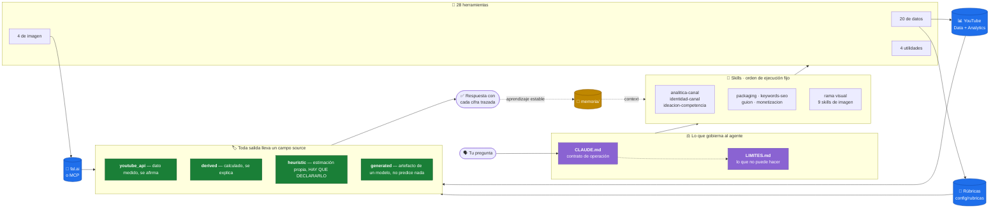

<div align="center">

# 🎬 youtube-agent

**Un coach de YouTube que mide antes de opinar.**

Un agente de [Claude Code](https://claude.com/claude-code) que analiza tu canal con datos reales
de la API y que es transparente sobre qué ha medido y qué se está inventando.

[](LICENSE)
[](https://www.python.org/)
[](https://claude.com/claude-code)
[](TOOLS.md)
[](#las-skills)
[](#)

</div>

---

No es un chatbot que opina sobre YouTube. Es un coach que mide primero y dice
"no lo sé" cuando no lo ha medido.

```
Tú:     ¿cómo va el canal?

Agente: [ejecuta yt_report.py, yt_analytics.py y yt_outliers_channels.py]

        8.412 subs, 47.930 vistas/28d    ← youtube_api
        Retención media 38,6%            ← derived, calculado sobre 21 vídeos
        Tu título puntúa 74/100          ← heuristic, rúbrica propia SIN VALIDAR
                                            contra CTR real. No es una predicción.

        (cifras de ejemplo)
```

Esa tercera línea es el punto del proyecto.

---

## 🔍 Cómo funciona

Cada dato que sale por la derecha lleva pegada su procedencia. El agente está
obligado por contrato a citarla, y eso es lo que impide que una estimación
propia se presente como una medición.



**El bucle de abajo es lo que lo convierte en coach y no en consultor de una
sesión:** lo que se aprende y es estable vuelve a `memoria/`, y desde ahí
calibra las rúbricas y alimenta las siguientes respuestas.

---

## Qué lo diferencia

**Cada cifra viaja con su procedencia.** Toda herramienta devuelve un campo
`source`: `youtube_api` (dato medido), `derived` (calculado), `heuristic`
(estimación propia), `config` (fichero local) o `generated` (imagen de un
modelo). `CLAUDE.md` obliga al agente a etiquetar cada número según ese campo.
Un score nunca se presenta como predicción de CTR.

**Las herramientas se niegan a inventar.** `score_thumbnail.py` puntúa el 40%
que puede medir sobre el pixel y devuelve el 60% restante **como preguntas sin
responder**, para que el agente abra la imagen y las conteste. Es más fácil
devolver un número redondo; por eso no lo hace.

**El agente lee sus propios ficheros antes de hablar de sí mismo.** Existe una
skill `transparencia` cuya primera regla es que responder de memoria está
prohibido. Nació de un fallo real y observado: un agente de referencia explicó
su orden de ejecución de memoria y tuvo que corregirse al turno siguiente.

**La proporción se verifica en el pixel.** Al generar una miniatura, el prompt
pide 16:9 y el payload lo pide otra vez — pero el modelo puede devolver otra
cosa. Así que se mide el fichero descargado, se recortan las bandas negras si el
modelo hizo letterbox, y se fuerza el tamaño exacto. La garantía está en el
resultado, no en la petición.

---

## Instalación

### 1. Requisitos

- Python 3.10 o superior
- [Claude Code](https://claude.com/claude-code)
- Una cuenta de Google con acceso al canal que vas a analizar
- Opcional: `yt-dlp` y `whisper-cli` para transcripciones
- Opcional: una clave de [fal.ai](https://fal.ai) o un MCP de imagen, para la rama visual

```bash
git clone https://github.com/TU-USUARIO/youtube-coach-harness.git
cd youtube-coach-harness
pip3 install -r requirements.txt
```

### 2. Credenciales de Google — el paso largo

La API de YouTube es gratuita pero hay que darse de alta. Son cinco minutos.

1. Entra en [Google Cloud Console](https://console.cloud.google.com/) y crea un
   proyecto.
2. En **APIs y servicios → Biblioteca**, activa estas dos:
   - *YouTube Data API v3*
   - *YouTube Analytics API*
3. En **Pantalla de consentimiento de OAuth**, elige **Externo**, rellena lo
   mínimo y **añádete a ti mismo como usuario de prueba**.
4. En **Credenciales → Crear credenciales → ID de cliente de OAuth**, tipo
   **Aplicación de escritorio**. Descarga el JSON.
5. Guárdalo aquí, con este nombre exacto:

```
datos/auth/client_secrets.json
```

6. Autoriza. Este comando **sí abre el navegador**, a propósito:

```bash
python3 tools/auth_setup.py
```

Se piden tres permisos, los tres de solo lectura:
`youtube.readonly`, `yt-analytics.readonly`, `yt-analytics-monetary.readonly`.
**El harness no puede publicar ni modificar nada en tu canal.**

> **Aviso:** mientras la app esté en modo *Testing*, Google caduca el token a
> los 7 días. Cuando las herramientas empiecen a salir con código 2, repite
> `python3 tools/auth_setup.py`. Para evitarlo, publica la app en la pantalla de
> consentimiento.

### 3. Cuenta quién eres

Este es el paso que la gente se salta y el que decide si el agente te sirve.

**`CLAUDE.md`, sección 1.** Sustituye los corchetes por tu tema, tu idioma y tu
audiencia. Con la concreción de un brief, no de una bio: *"personas celíacas
recién diagnosticadas que no saben por dónde empezar"* es un nicho; *"gente
interesada en cocinar"* no lo es.

**`config/config.json`.** Rellena `channel_context` describiendo tu canal como
se lo describirías a un consultor que cobra por hora.

**`config/channels_lists.json`.** Tus competidores, tus inspiraciones y tu
vecindario. Puedes dejarlo vacío y pedirle al agente que los proponga.

### 4. Primera medición

```bash
python3 tools/yt_report.py     # línea base y primer snapshot al histórico
```

Abre Claude Code en el directorio. El hook de arranque te dirá el estado.

### 5. Opcional: la rama de imagen

Para generar miniaturas, banner o foto de perfil. Dos caminos, y las skills no
saben cuál usas: se elige en `config/image_providers.json`.

**fal.ai por API:**
```bash
cp .env.example .env     # y escribe dentro tu FAL_KEY
```

**Un MCP de imagen** (Higgsfield u otro): declara el servidor en `.mcp.json`,
pon `"provider": "mcp"` en la config y ajusta el mapa de `tools`. En este modo
las herramientas no generan: devuelven la llamada exacta para que la ejecute el
agente, porque un script no puede invocar una tool MCP de la sesión.

Comprueba antes de gastar créditos:
```bash
python3 tools/generate_image.py --type thumbnail --prompt "una prueba" --dry-run --md
```

---

## Qué hay aquí

| Ruta | Qué es |
|---|---|
| `CLAUDE.md` | El contrato de operación: identidad, reglas de honestidad, protocolo de transparencia |
| `TOOLS.md` | Catálogo de las 28 herramientas con su comando y su coste de cuota |
| `LIMITES.md` | Lo que el harness **no** puede hacer. Léelo antes de pedirle imposibles |
| `.claude/skills/` | 17 skills, cada una con su orden de ejecución de herramientas |
| `memoria/` | Perfil, voz, posicionamiento y SOPs. **Empieza vacío** |
| `tools/` | 20 de datos, 4 de imagen, 4 utilidades |
| `config/rubricas/` | Rúbricas de scoring. **Empiezan sin calibrar** |
| `datos/` | Credenciales, caché, histórico e informes. Fuera de git |

### Las skills

| | |
|---|---|
| `analitica-canal` | Auditoría con datos reales: rendimiento, retención, tráfico |
| `identidad-canal` | Posicionamiento y diferenciación frente al vecindario |
| `ideacion-competencia` | Ideas a partir de outliers reales de la competencia |
| `packaging` | Títulos y miniaturas puntuados con la rúbrica |
| `keywords-seo` | Keywords, etiquetas y hueco de búsqueda |
| `guion` | Guiones con tu voz real y estructura de retención |
| `monetizacion` | Umbrales del Programa de Socios y proyección |
| `transparencia` | Qué es el agente, qué tiene y en qué orden ejecuta |
| **Rama visual** | `image-generation-core`, `image-refinement`, `likeness-preservation`, `thumbnail-best-practices`, `thumbnail-inspiration`, `analyse-thumbnails`, `analyse-channel-packaging`, `youtube-banner-spec`, `youtube-profile-spec` |

Y el comando `/radar`, para el escaneo semanal de competencia.

---

## Lo que NO hace

Está entero en `LIMITES.md`. Lo que más sorprende:

- **No hay CTR ni impresiones.** No están en la API pública, solo en Studio. Se
  importan a mano con `tools/ingest_studio_csv.py`.
- **No hay volumen de búsqueda real.** `kw_research.py` es un proxy que ordena
  keywords entre sí dentro de una misma ejecución. Comparar dos ejecuciones
  distintas no es válido.
- **No se publica ni se modifica nada en YouTube.** Los scopes son de lectura.
  El harness te da el texto y la ruta del fichero; subirlo es cosa tuya.
- **De canales ajenos solo lo público.** Nunca su retención ni su tráfico.
  Cuando un informe hable de eso, es inferencia y hay que decirlo.

---

## Las rúbricas empiezan sin calibrar

Es lo más importante que hay que entender antes de fiarte de un número.

En el harness del que sale este proyecto, cada eje de `config/rubricas/` era
trazable a una lección aprendida en un vídeo real, y el campo `memoria` apuntaba
al fichero que la justificaba. **Aquí esos campos están a `null`.**

Las rúbricas que vienen son un punto de partida razonable, no la destilación de
las lecciones de tu canal. Algunos ejes están marcados `ADAPTAR` porque
codifican una decisión editorial concreta de otra persona.

Se calibran así: usas el harness, descubres algo sobre tus títulos, lo escribes
en `memoria/` y apuntas el eje a ese fichero. Cuando además ingieras el CSV de
Studio con tu CTR real, `validado_contra_ctr` podrá pasar a `true`.

Hasta entonces, el agente tiene que decir en cada score que es una estimación
propia sin validar. Si no lo dice, algo va mal.

---

## Prueba de aceptación

Pregúntale: *"¿cuál es el orden de ejecución de tools por cada skill?"*

Debe leer los `SKILL.md` uno por uno y citarlos, no improvisar una síntesis.
Si contesta de memoria, el protocolo de transparencia no está funcionando.

---

## Cuota

10.000 unidades diarias de la API de YouTube. Casi toda llamada cuesta 1-3;
**`search.list` cuesta 100** y lo usan `yt_search.py` y `kw_research.py`. Todo
se cachea en `datos/cache/` con TTL por familia. `--no-cache` fuerza la llamada.

## Licencia

MIT. Ver `LICENSE`.
