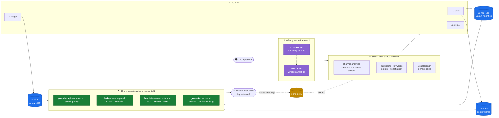

<div align="center">

# 🎬 youtube-agent

**A YouTube coach that measures before it opines.**

A [Claude Code](https://claude.com/claude-code) agent that analyses your channel with real
API data and is honest about what it measured and what it is guessing.

[](https://github.com/lorena-bordonaba-pau/youtube-agent/actions/workflows/tests.yml)
[](LICENSE)
[](https://www.python.org/)
[](https://claude.com/claude-code)
[](TOOLS.md)
[](#the-skills)

[Quick start](#quick-start) · [What you can ask](#what-you-can-ask-it) · [How it works](#how-it-works) · [Español](docs/README_es.md)

</div>

---

## The point of the whole project

Most AI channel advice sounds confident and is unfalsifiable. This one labels
every number with where it came from:

```
You:    how's the channel doing?

Agent:  [runs yt_report.py, yt_analytics.py and yt_outliers_channels.py]

        8,412 subs · 47,930 views/28d   ← youtube_api    measured
        Mean retention 38.6%            ← derived        computed over 21 videos
        Your title scores 74/100        ← heuristic      MY OWN RUBRIC, UNVALIDATED
                                          against real CTR. Not a prediction.

        (example figures)
```

That third line is the project. Every tool returns a `source` field, and
[the operating contract](CLAUDE.md) forces the agent to respect it. A rubric
score can never be dressed up as a measurement.

Three things follow from that, and they are unusual:

- **The tools refuse to invent.** `score_thumbnail.py` scores the 40% it can
  measure from pixels and returns the other 60% **as unanswered questions**, so
  the agent has to open the image and answer them. Returning a round number
  would be easier. That is why it does not.
- **The agent reads its own files before talking about itself.** There is a
  `transparency` skill whose first rule is that answering from memory is
  forbidden. It exists because of a real, observed failure: an agent explained
  its own execution order from memory and had to correct itself a turn later.
- **Aspect ratio is verified in the pixels.** When generating a thumbnail the
  prompt asks for 16:9 and the payload asks again — but the model can return
  something else. So the downloaded file is measured, letterbox bars are
  trimmed, and the exact size is forced. The guarantee lives in the result, not
  in the request.

---

## Quick start

**The fastest path needs no OAuth.** An API key is enough for everything
public — any channel's stats, video data, search, thumbnails, transcripts:

```bash
git clone https://github.com/lorena-bordonaba-pau/youtube-agent.git
cd youtube-agent
pip3 install -r requirements.txt

cp .env.example .env        # put YOUTUBE_API_KEY in it
python3 tools/yt_channel_stats.py --channel UCxxxxxxxx --md
```

Get the key at [Google Cloud Console](https://console.cloud.google.com/) →
*APIs & Services* → *Credentials* → *Create credentials* → *API key*, after
enabling **YouTube Data API v3**. No consent screen, no browser.

Then open Claude Code in the directory. The start-up hook tells you what is
missing.

> **Not a developer?** Paste this to your agent and it will set everything up:
>
> ```
> Install this YouTube coach harness for me, following its install guide:
> https://raw.githubusercontent.com/lorena-bordonaba-pau/youtube-agent/main/docs/install.md
> ```

**[→ Full install guide, including your own channel's analytics](docs/install.md)**

---

## What you can ask it

No commands to learn. You talk, it runs the tools and shows its sources.

| You say | What it actually does |
|---|---|
| *"How's the channel doing?"* | Full report, snapshot to history, compares against the last one |
| *"Why did my last video flop?"* | Retention curve, traffic sources, contrast against your own outliers |
| *"Give me titles for this video"* | Generates them, scores each with the rubric, backs them with real search terms |
| *"Is this thumbnail any good?"* | Measures contrast and saturation, then **opens it** and answers the judgement axes |
| *"What's blowing up in my niche?"* | Scans your competitor list for outliers, filtered by freshness |
| *"What should I record this week?"* | Ideas from real outliers, crossed against what already works for you |
| *"Write the script"* | Uses your voice profile, built from your own transcripts — never invented |
| *"Where do people drop off?"* | 101-point retention curve, flags concentrated exits |
| *"What keywords should I use?"* | Real search terms that already bring you traffic, plus a proxy for the rest |
| *"Make me a thumbnail"* | Generates it, forces 16:9, trims letterboxing, then scores it |
| *"Redesign my banner"* | Reads your current branding, respects the mobile safe zone |
| *"When do I hit monetisation?"* | Projects from measured trend, with the assumption stated |
| *"What tools do you have?"* | **Reads the files and quotes them.** Answering from memory is forbidden |

---

## How it works



**The loop at the bottom is what makes it a coach rather than a one-session
consultant:** what it learns, and that stays true, goes back into `memory/`,
which then calibrates the rubrics and feeds later answers.

---

## What's in here

| Path | What it is |
|---|---|
| [`CLAUDE.md`](CLAUDE.md) | The operating contract: identity, honesty rules, transparency protocol |
| [`TOOLS.md`](TOOLS.md) | All 28 tools with their command and quota cost |
| [`LIMITS.md`](LIMITS.md) | What the harness **cannot** do. Read it before asking the impossible |
| `.claude/skills/` | 17 skills, each with a fixed tool execution order |
| `memory/` | Profile, voice, positioning, SOPs. **Starts empty** |
| `tools/` | 20 data · 4 image · 4 utilities |
| `config/rubrics/` | Scoring rubrics. **Start uncalibrated** |
| `tests/` | Offline suite: no credentials, no network, no quota |
| `data/` | Credentials, cache, history, reports. Git-ignored |

### The skills

| | |
|---|---|
| `channel-analytics` | Audit with real data: performance, retention, traffic |
| `channel-identity` | Positioning and differentiation against your neighbourhood |
| `competitor-ideation` | Ideas from real competitor outliers |
| `packaging` | Titles and thumbnails scored with the rubric |
| `keywords-seo` | Keywords, tags, and the search gap |
| `script-writing` | Scripts in your real voice, with a retention structure |
| `monetisation` | Partner Programme thresholds and projection |
| `transparency` | What the agent is, what it has, in what order it runs |
| **Visual branch** | `image-generation-core` · `image-refinement` · `likeness-preservation` · `thumbnail-best-practices` · `thumbnail-inspiration` · `analyse-thumbnails` · `analyse-channel-packaging` · `youtube-banner-spec` · `youtube-profile-spec` |

Plus the `/radar` command, for the weekly competitor scan.

---

## What it does NOT do

The full list is in [`LIMITS.md`](LIMITS.md). The ones that surprise people:

- **No CTR, no impressions.** They are not in the public API, only in Studio.
  You import them by hand with `tools/ingest_studio_csv.py`.
- **No real search volume.** `kw_research.py` is a proxy that ranks keywords
  against each other *within a single run*. Comparing two runs is not valid.
- **It never publishes or changes anything on YouTube.** The scopes are
  read-only. The harness gives you the text and the file path; uploading is
  yours.
- **For other channels, only what is public.** Never their retention or
  traffic. When a report talks about that, it is inference and must say so.

---

## The rubrics start uncalibrated

This is the most important thing to understand before trusting a number.

In the harness this came from, every axis in `config/rubrics/` traced back to a
lesson learned on a real video, and the `memory` field pointed at the file that
justified it. **Here those fields are `null`.**

The rubrics you get are a reasonable starting point, not the distillation of
your channel's lessons. Some axes are marked `ADAPT` because they encode
somebody else's editorial decision.

You calibrate them like this: use the harness, learn something about your own
titles, write it into `memory/`, and point the axis at that file. Once you
also ingest the Studio CSV with your real CTR, `validated_against_ctr` can
finally become `true`.

Until then the agent has to say, on every score, that it is an unvalidated own
estimate. If it does not, something is wrong.

---

## Acceptance test

Ask it: *"what is the tool execution order for each skill?"*

It must read the `SKILL.md` files one by one and quote them, not improvise a
summary. If it answers from memory, the transparency protocol is not working.

---

## Quota

10,000 YouTube API units per day. Almost every call costs 1–3;
**`search.list` costs 100**, used by `yt_search.py` and `kw_research.py`.
Everything is cached in `data/cache/` with a TTL per family. `--no-cache`
forces the call.

## Contributing

Issues and pull requests are welcome — see [CONTRIBUTING.md](CONTRIBUTING.md).
The one rule that is not negotiable: **a new tool must declare its `source`,
and must not present an estimate as a measurement.**

## License

MIT. See [LICENSE](LICENSE).
