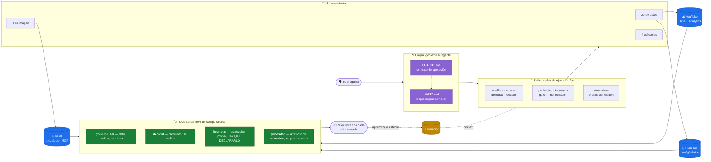

<div align="center">

# 🎬 youtube-agent

**Un coach de YouTube que mide antes de opinar.**

Un agente de [Claude Code](https://claude.com/claude-code) que analiza tu canal con datos
reales de la API y que es honesto sobre qué ha medido y qué está estimando.

[](https://github.com/lorena-bordonaba-pau/youtube-coach-harness/actions/workflows/tests.yml)
[](../LICENSE)
[](https://www.python.org/)
[](../TOOLS.md)

[Inicio rápido](#inicio-rápido) · [Qué le puedes pedir](#qué-le-puedes-pedir) · [Cómo funciona](#cómo-funciona) · [English](../README.md)

</div>

---

> **Nota:** el repositorio está en inglés. Esta página es la versión española
> del README; el resto de la documentación (`CLAUDE.md`, `TOOLS.md`,
> `LIMITS.md`, las skills) está en inglés, aunque **el agente responde en el
> idioma que definas en la sección 1 de `CLAUDE.md`**.

## De qué va todo esto

Casi todo el consejo de IA sobre canales suena seguro y no se puede falsar.
Este etiqueta cada número con su procedencia:

```
Tú:     ¿cómo va el canal?

Agente: [ejecuta yt_report.py, yt_analytics.py y yt_outliers_channels.py]

        8.412 subs · 47.930 vistas/28d   ← youtube_api    medido
        Retención media 38,6%            ← derived        calculado sobre 21 vídeos
        Tu título puntúa 74/100          ← heuristic      RÚBRICA PROPIA, SIN VALIDAR
                                           contra CTR real. No es una predicción.

        (cifras de ejemplo)
```

Esa tercera línea es el proyecto. Cada herramienta devuelve un campo `source`, y
[el contrato de operación](../CLAUDE.md) obliga al agente a respetarlo. El score
de una rúbrica nunca puede disfrazarse de medición.

De ahí salen tres cosas, y no son habituales:

- **Las herramientas se niegan a inventar.** `score_thumbnail.py` puntúa el 40%
  que puede medir sobre el pixel y devuelve el 60% restante **como preguntas
  sin responder**, para que el agente abra la imagen y las conteste. Devolver un
  número redondo sería más fácil. Por eso no lo hace.
- **El agente lee sus propios ficheros antes de hablar de sí mismo.** Hay una
  skill `transparencia` cuya primera regla es que responder de memoria está
  prohibido. Nació de un fallo real y observado.
- **La proporción se verifica en el pixel.** Al generar una miniatura el prompt
  pide 16:9 y el payload lo pide otra vez, pero el modelo puede devolver otra
  cosa. Así que se mide el fichero descargado, se recortan las bandas negras y
  se fuerza el tamaño exacto.

---

## Inicio rápido

**El camino corto no necesita OAuth.** Con una API key basta para todo lo
público: stats de cualquier canal, datos de vídeo, búsqueda, miniaturas,
transcripciones.

```bash
git clone https://github.com/lorena-bordonaba-pau/youtube-coach-harness.git
cd youtube-coach-harness
pip3 install -r requirements.txt

cp .env.example .env        # escribe dentro tu YOUTUBE_API_KEY
python3 tools/yt_channel_stats.py --channel UCxxxxxxxx --md
```

La clave se saca en [Google Cloud Console](https://console.cloud.google.com/) →
*APIs y servicios* → *Credenciales* → *Crear credenciales* → *Clave de API*,
tras activar **YouTube Data API v3**. Sin pantalla de consentimiento, sin
navegador.

Después abre Claude Code en el directorio. El hook de arranque te dice qué falta.

**[→ Guía de instalación completa, incluida la analítica de tu canal](install.md)**

---

## Qué le puedes pedir

No hay comandos que aprender. Hablas, y él ejecuta las herramientas y enseña sus
fuentes.

| Tú dices | Qué hace en realidad |
|---|---|
| *"¿Cómo va el canal?"* | Informe completo, snapshot al histórico, compara con el anterior |
| *"¿Por qué se hundió mi último vídeo?"* | Curva de retención, tráfico, contraste con tus propios outliers |
| *"Dame títulos para este vídeo"* | Los genera, los puntúa con la rúbrica y los respalda con términos reales |
| *"¿Esta miniatura está bien?"* | Mide contraste y saturación, y luego **la abre** y responde los ejes de juicio |
| *"¿Qué está petando en mi nicho?"* | Escanea tu lista de competencia buscando outliers, filtrados por frescura |
| *"¿Qué grabo esta semana?"* | Ideas desde outliers reales, cruzadas con lo que ya te funciona |
| *"Escribe el guion"* | Usa tu perfil de voz, construido con tus transcripciones. Nunca inventado |
| *"¿Dónde abandona la gente?"* | Curva de retención de 101 puntos, marca los abandonos concentrados |
| *"¿Qué keywords uso?"* | Términos reales que ya te traen tráfico, más un proxy para el resto |
| *"Hazme una miniatura"* | La genera, fuerza 16:9, recorta el letterbox y la puntúa |
| *"Rediseña mi banner"* | Lee tu branding actual y respeta la zona segura móvil |
| *"¿Cuándo llego a monetización?"* | Proyecta sobre la tendencia medida, con el supuesto declarado |
| *"¿Qué herramientas tienes?"* | **Lee los ficheros y los cita.** Responder de memoria está prohibido |

---

## Cómo funciona



**El bucle de abajo es lo que lo convierte en coach y no en consultor de una
sesión:** lo que aprende y es estable vuelve a `memory/`, y desde ahí calibra
las rúbricas y alimenta las siguientes respuestas.

---

## Lo que NO hace

La lista completa está en [`LIMITS.md`](../LIMITS.md). Lo que más sorprende:

- **No hay CTR ni impresiones.** No están en la API pública, solo en Studio. Se
  importan a mano con `tools/ingest_studio_csv.py`.
- **No hay volumen de búsqueda real.** `kw_research.py` es un proxy que ordena
  keywords entre sí *dentro de una misma ejecución*.
- **No publica ni modifica nada en YouTube.** Los scopes son de solo lectura.
- **De canales ajenos, solo lo público.** Nunca su retención ni su tráfico.

---

## Las rúbricas empiezan sin calibrar

Es lo más importante que hay que entender antes de fiarse de un número.

En el harness del que sale esto, cada eje de `config/rubrics/` era trazable a
una lección aprendida en un vídeo real. **Aquí esos campos están a `null`.**

Se calibran usando el harness, descubriendo algo sobre tus propios títulos,
escribiéndolo en `memory/` y apuntando el eje a ese fichero. Hasta entonces el
agente tiene que decir, en cada score, que es una estimación propia sin validar.

---

## Prueba de aceptación

Pregúntale: *"¿cuál es el orden de ejecución de tools por cada skill?"*

Debe leer los `SKILL.md` uno por uno y citarlos, no improvisar una síntesis.

## Licencia

MIT. Ver [LICENSE](../LICENSE).
